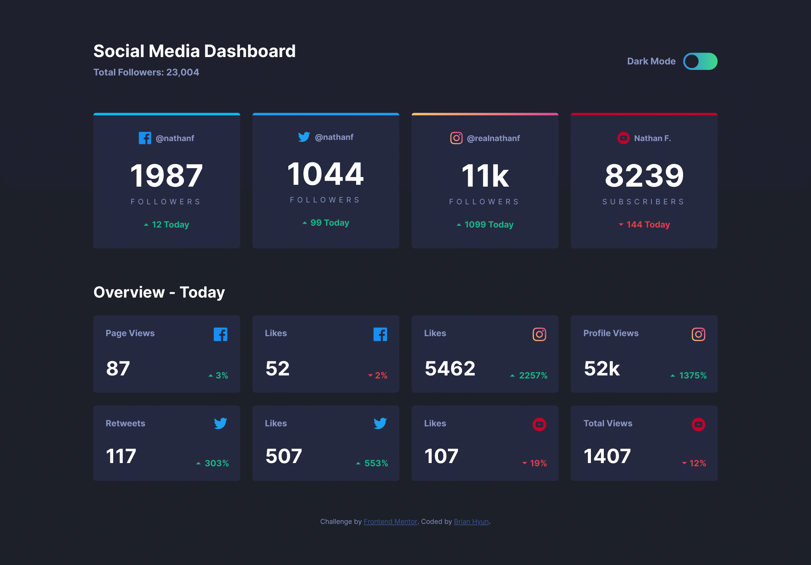
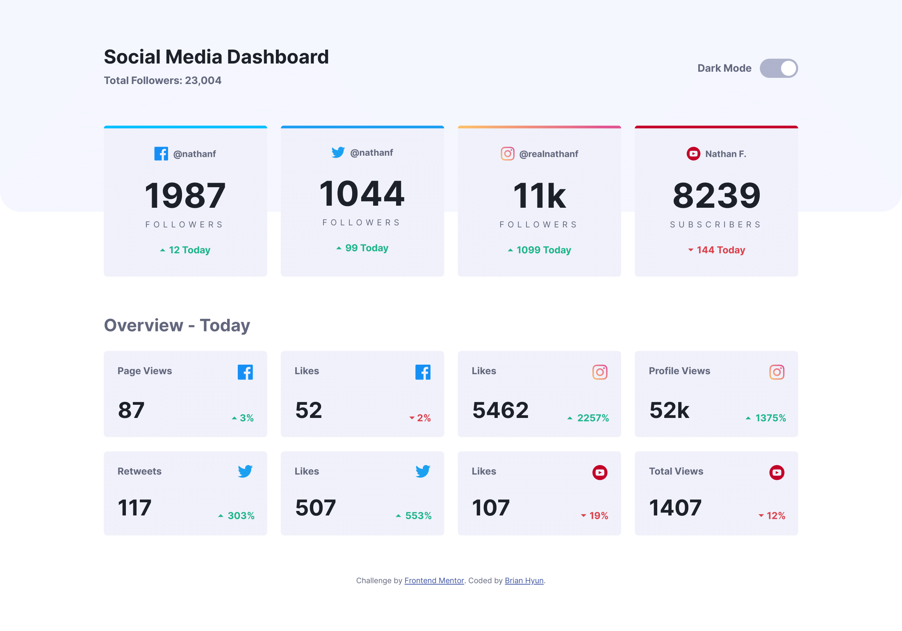
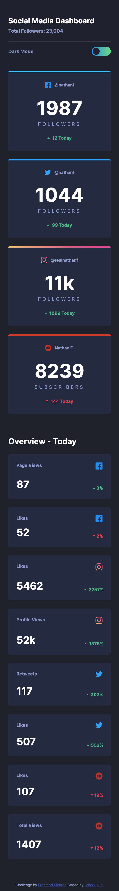
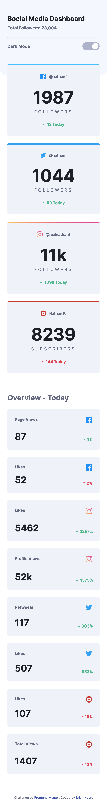

# Frontend Mentor Challenge - HTML/CSS/JS
## Social Media Dashboard Challenge

[Link to Completed Web Page](https://brianhyun.github.io/frontend-mentor-social-media-dashboard-challenge)

The challenge was to recreate the web page as presented in the design file provided by Frontend Mentor.

### Frontend Mentor Reference Screenshot - Desktop, Dark

### Frontend Mentor Reference Screenshot - Desktop, Light

### Frontend Mentor Reference Screenshot - Mobile, Dark

### Frontend Mentor Reference Screenshot - Mobile, Light

### Personal Screenshot - Desktop, Dark

### Personal Screenshot - Desktop, Light

### Personal Screenshot - Mobile, Dark

### Personal Screenshot - Mobile, Light

